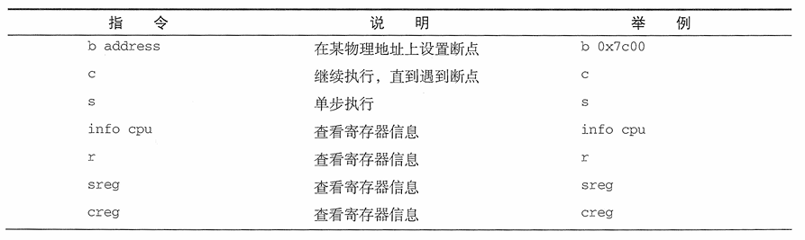
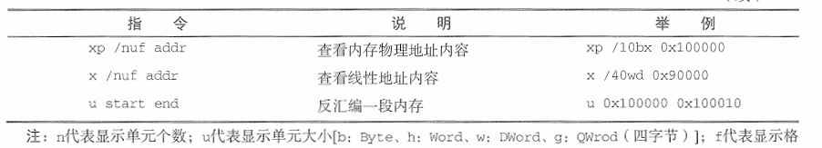

# 环境搭建
- 虚拟机：VMware+debian12+bochs（debian系统上编译出的操作系统跑在bochs虚拟机上） 

 
&emsp;&emsp;先是装了debian11虚拟机，装机过程中在宿主机上开启了clash的TUN模式，照理来说此时clash会接管所有的网络层流量包，但来自VMware的流量并没有走代理。安装过程中下载桌面环境等就干等一个半小时，平均25KB/S，虽然选择的清华大学镜像源，但似乎仍然是从官方源下载。 
&emsp;&emsp;睡了个午觉起来装好了，vscode连个ssh先。不出意外地连接失败。检查VMware网络模式为NAT网络连接，切换为桥接模式，然后debian里找不到网络连接了。桥接模式使用物理网卡，找不到有线网络还合情合理，毕竟我没插网线，但无线网络也找不到。换端口转发大法，设置ip:22映射到127.0.0.1:20022，再用vscode连接，又寄。换个mobaxterm连上了，应该是vscode的问题。检查连接失败的输出，发现是以前连过127.0.0.1:20022的虚拟机，导致指纹不匹配，删除.ssh/known_hosts中有关127.0.0.1:20022的条目后成功连接。为了快乐开代理，打算在虚拟机里装clash，发现.AppImage运行不了，安装.deb显示超多库版本不匹配。受不了，装个debian12，重复上面步骤，目前情况良好。