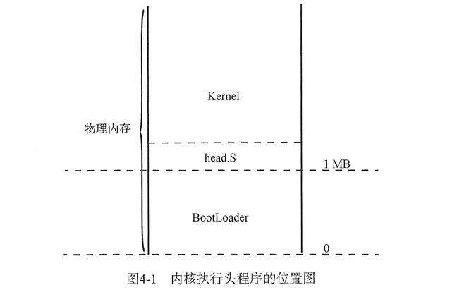

- 内核执行头程序：编译到内核程序起始处的汇编程序。 
&emsp;&emsp;内核层其实线性地址0xffff800000000000对应物理地址0，内核程序起始线性地址位于0xffff800000000000+0x100000.

# 内核主程序
&emsp;&emsp;负责调用各个系统模块的初始化函数，创建初始进程。
# 屏幕显示
&emsp;&emsp;利用帧缓冲存储器实现。帧缓冲线性地址为0xffff800000a00000和0xa00000。首先定义各字符的码点表示，再实现print功能。vsprintf()函数用于将字符保存到一个大小为4096的缓存中，同时需检测%d等转义字符，将其替换为后续格式化结果。
# 系统异常

&emsp;&emsp;entry.S中的代码将do_function()和function()绑定，进行错误处理前操作后跳转到异常处理函数。
# 内存管理
